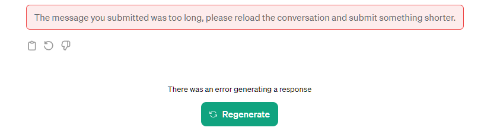
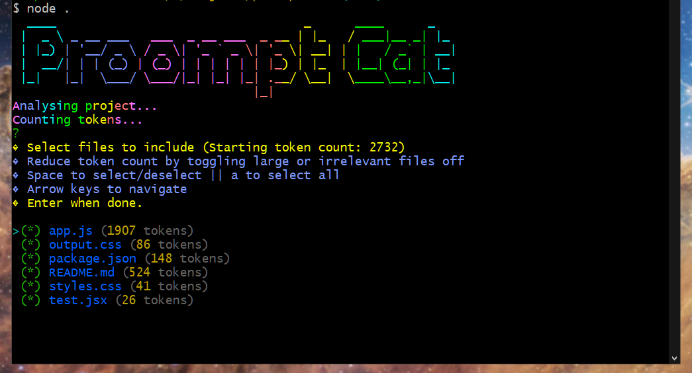
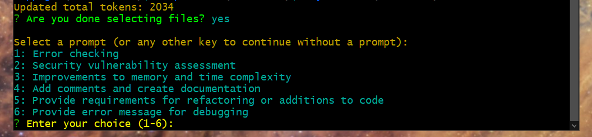
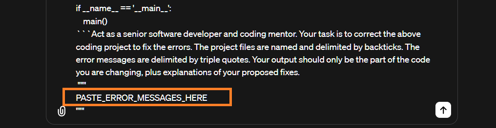
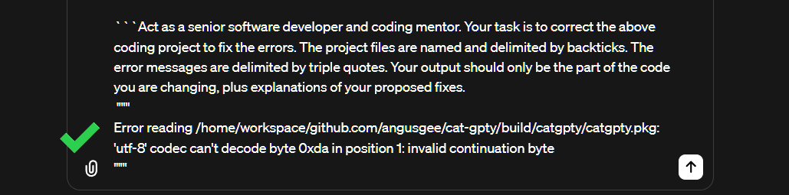

# Proompt Cat

[](https://www.npmjs.com/package/proompt-cat)[](https://github.com/yourusername/proompt-cat/blob/main/LICENSE)[](https://www.npmjs.com/package/proompt-cat)

Turbocharge your software development workflows by leveraging the power of AI.

When seeking coding help from AI models like GPT-4, you want to:

1. Give the model as much _relevant_ context as possible without exceeding the token limit.
2. Name your files and use delimiters to help the AI understand the content.
3. Explicitly instruct the model with clear and unambiguous prompts.

However, copying your project files, naming them, and delimiting them manually, is time consuming.

Also, you won't know you're going to exceed the token limit until you do:

<p align="center">
  
</p>

## ⚡ The Solution ⚡

Proompt Cat solves these issues for you.

Run the script from your folder and select the files you want to include. The token count is dynamically updated:

<p align="center">
  
</p>

Next, choose to add on a pre-prompt:

<p align="center">
  
</p>

The contents of your project files are individually named, delimited, and concatenated together, then copied to your clipboard.

You get the optimum context from your project with only a few key presses. 🚀🚀

Remember to paste in your requirements or error messages into the LLM if you chose 5. or 6:

<p align="center">

</p>

<p align="center">
  
</p>

💡 Pro tip: iterate! It pays to have the AI check its answers. You can also combine prompts - first review your code for bugs, then again for vulnerabilities, and so on.

## Getting started

NOTE: this is an early release. It was developed on WSL Ubuntu and has been tested on Kali.

1. Start by running this command to install the tool globally using npm.

```bash
npm install -g proompt-cat
```

2. Now you should be able to run the script from any project folder.

```bash
proompt-cat
```
